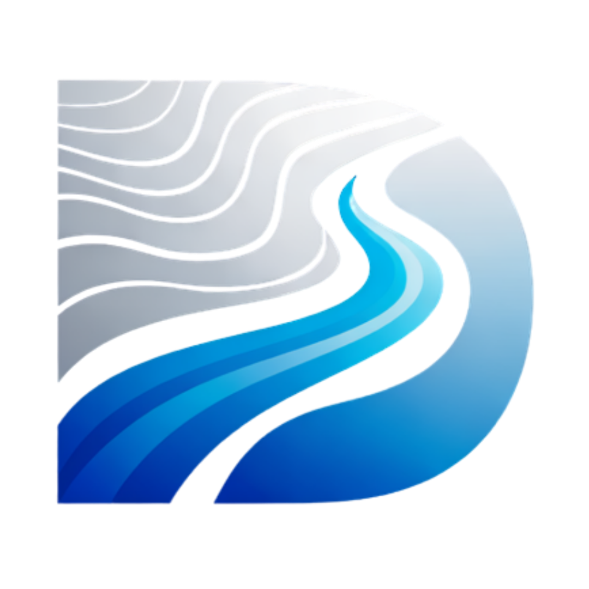
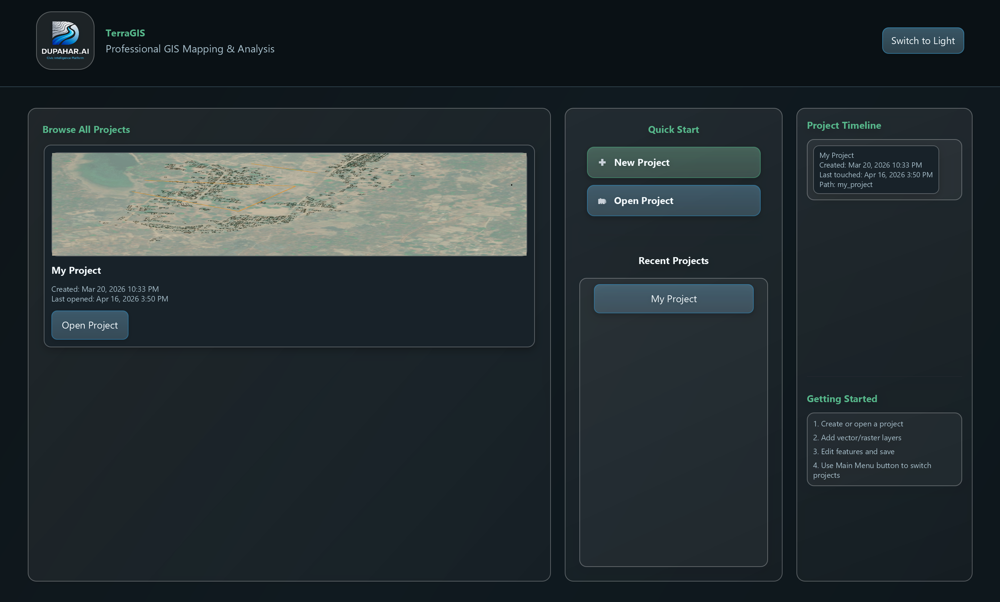

<div align="center">
  
  
  # TerraGIS Website
  
  **Professional Desktop GIS Software for Windows by Dupahar**

  [](https://terragis.co.in/)

  [](https://nextjs.org/)
  [](https://react.dev/)
  [](https://www.typescriptlang.org/)
  [](https://tailwindcss.com/)
  [](https://www.framer.com/motion/)

  [Explore Features](#features) •
  [Getting Started](#getting-started) •
  [Architecture](#architecture) •
  [Showcase](#showcase)
</div>

---

## 🌍 Overview

This repository contains the source code for the official product website of **TerraGIS** — the cutting-edge Geographic Information System (GIS) software developed by Dupahar. 

Built with modern web technologies, this landing page is designed to showcase TerraGIS's capabilities, including its powerful AI integrations, professional mapping tools, and unparalleled performance on Windows.

<details>
<summary>✨ <b>Click to see what makes this website special</b></summary>

- **Dynamic Animations**: Powered by Framer Motion for a premium, interactive user experience.
- **Glassmorphism Design**: Sleek, modern aesthetics using Tailwind CSS.
- **SEO Optimized**: Fully semantic HTML and structured data for maximum search visibility.
- **Responsive & Accessible**: Works flawlessly across all devices and screen sizes.
</details>

---

## 🚀 Features

### Core Sections
- **Hero & Feature Strip**: High-impact introduction with dynamic top-level benefits.
- **Product Showcase**: An interactive, auto-playing carousel of TerraGIS in action (`public/screenshot-1.png`, `public/screenshot-2.png`, etc.).
- **TerraAI**: Highlighting our revolutionary AI-assisted mapping and spatial analysis tools.
- **Pricing**: Transparent, professional tier breakdown for individual and enterprise users.
- **Use Cases**: Demonstrating value across various industries (Urban Planning, Environmental, etc.).
- **Download & Contact**: Seamless lead generation and acquisition flows.

---

## 💻 Getting Started

To run the TerraGIS product website locally, follow these steps:

### Prerequisites
- Node.js 18.17 or later
- npm or yarn

### Installation

1. **Clone the repository**
   ```bash
   git clone https://github.com/Dupahar/TerraGIS-Website.git
   cd TerraGIS-Website
   ```

2. **Install dependencies**
   ```bash
   npm install
   # or
   yarn install
   ```

3. **Run the development server**
   ```bash
   npm run dev
   # or
   yarn dev
   ```

4. **Open your browser**
   Navigate to [http://localhost:3000](http://localhost:3000) to see the site in action.

---

## 🛠️ Architecture

This project is built on a robust modern stack:

- **Framework**: [Next.js](https://nextjs.org/) (App Router)
- **Styling**: [Tailwind CSS](https://tailwindcss.com/) with a custom design system defined in `src/lib/theme.ts`
- **Animations**: [Framer Motion](https://www.framer.com/motion/) for micro-interactions and scroll-triggered animations.
- **Icons**: [Lucide React](https://lucide.dev/) for crisp, scalable vector iconography.

### Folder Structure

```text
src/
├── app/                  # Next.js App Router (Pages & Layouts)
│   ├── globals.css       # Global styles & Tailwind directives
│   ├── layout.tsx        # Root layout & metadata
│   └── page.tsx          # Main landing page
├── components/
│   ├── sections/         # Major page sections (Hero, Pricing, etc.)
│   └── ui/               # Reusable UI components (Nav, Dividers, Buttons)
├── lib/                  # Utilities and theme configuration
│   └── theme.ts          # Design tokens (colors, typography)
public/                   # Static assets (Logos, Screenshots)
```

---

## 📸 Showcase

<div align="center">
  
  
</div>

---

<div align="center">
  <p>Built with 💙 by the <b>Dupahar</b> Team.</p>
  <p>
    <a href="https://dupahar.com">Website</a> •
    <a href="mailto:contact@dupahar.com">Contact Us</a>
  </p>
</div>
